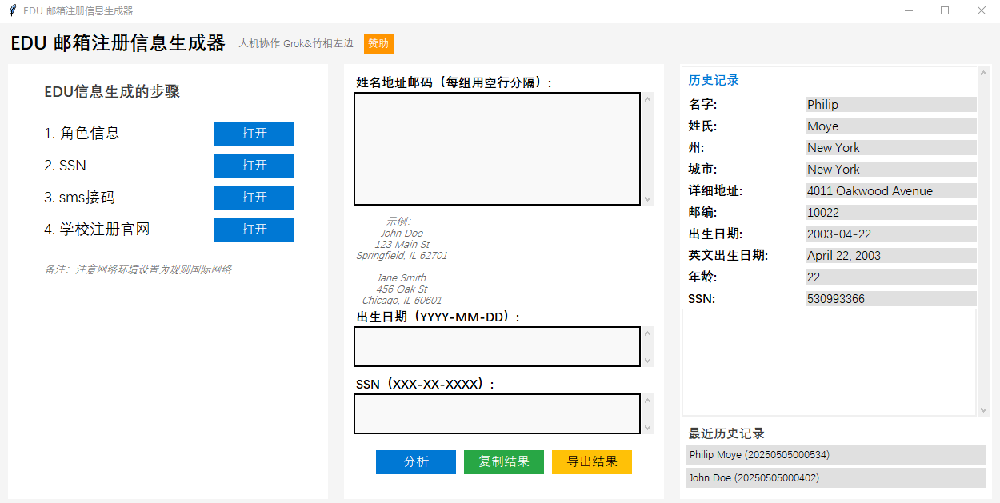

# 最新版本 20250505



```
D:\竹相左边20250219\ai_work\news0429
├── core/
│   └── extractor.py
├── mappings/
│   ├── european_countries.py
│   └── us_states.py
├── ui/
│   ├── gui.py
│   ├── links_config.py
│   └── sponsor_config.py
├── util/
│   └── helpers.py
├── static/
│   └── images/
│       └── qr_code.jpg
├── templates/
│   ├── index.html
│   ├── result.html
│   └── sponsor.html
├── .dockerignore
├── .gitignore
├── app.py
├── input_data.txt
├── LICENSE
├── main_gui.py
├── README.md
├── requirements.txt
└── Dockerfile
```