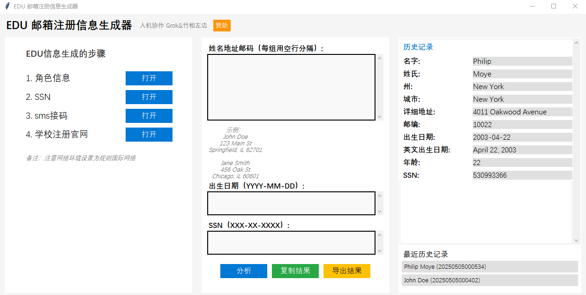

[ ](https://colab.research.google.com/github/peter-zx/IDfenxi) 


# 最新版本 20250505



```
D:\竹相左边20250219\ai_work\news0429
/home/bamboox/IDfenxi
├── app.py
├── build
│   └── IDfenxiGUI
│       ├── Analysis-00.toc
│       ├── base_library.zip
│       ├── EXE-00.toc
│       ├── IDfenxiGUI.pkg
│       ├── PKG-00.toc
│       ├── PYZ-00.pyz
│       ├── PYZ-00.toc
│       ├── warn-IDfenxiGUI.txt
│       └── xref-IDfenxiGUI.html
├── core
│   └── extractor.py
├── dist
│   └── IDfenxiGUI.exe
├── Dockerfile
├── gunicorn.conf.py
├── gunicorn.log
├── IDfenxiGUI.spec
├── image.png
├── images
│   └── qr_code.jpg
├── input_data.txt
├── LICENSE
├── main_gui.py
├── mappings
│   ├── european_countries.py
│   └── us_states.py
├── nohup.out
├── project_structure.txt
├── README.md
├── records
├── requirements.txt
├── static
│   └── qr_code.jpg
├── templates
│   ├── index.html
│   ├── result.html
│   └── sponsor.html
├── ui
│   ├── gui.py
│   ├── links_config.py
│   └── sponsor_config.py
└── utils
    └── helpers.py

```
